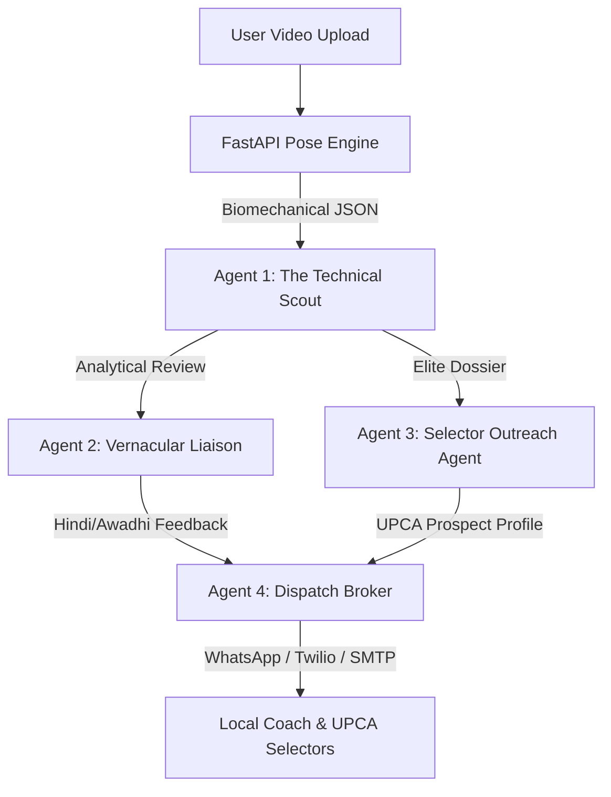

# GullyScout AI 🏏
### *Empowering Grassroots Cricket via Agentic Biomechanics & Autonomous Scouting Pipelines*

[](https://github.com/)
[](https://github.com/)
[](https://github.com/)

---

## 🌟 Executive Summary
**GullyScout AI** is an advanced, multi-agent sports analytics platform designed to bridge the gap between Lucknow’s thriving gully/club cricket culture—from the dust bowls of Aliganj and Rajajipuram maidans to the high-tech shadow of the **Ekana Cricket Stadium**—and formal talent recognition channels like the **Uttar Pradesh Cricket Association (UPCA)**.

By leveraging **real-time biomechanical pose estimation** on standard smartphone video uploads and orchestrating a team of specialized AI agents, GullyScout AI extracts dimensionless joint-angle telemetry, evaluates player mechanics against professional baselines, and autonomously routes structured talent scouting dossiers directly to selectors.

---

## 🎯 The Problem & Local Context
Lucknow has an incredibly deep pool of raw cricket talent. However, the path from street cricket to formal academy selection is highly fragmented:
- **No Scouting Infrastructure:** Promising players in local maidans (Aliganj, Rajajipuram, Chinhat) go completely unnoticed due to a lack of scouts at the grassroots level.
- **Biomechanical Barriers:** Many young bowlers develop illegal actions (e.g., "chucking" or bending the elbow beyond the ICC-mandated $15^\circ$ limit) or injury-prone batting stances without realizing it.
- **Language & Formal Barriers:** Talented local players and vernacular coaches speak conversational Hindi or Awadhi and cannot draft professional profiles or navigate formal recruitment pipelines.

GullyScout AI solves this by turning any mobile phone into a **professional biomechanics laboratory and autonomous talent agent**.

---

## 🤖 Multi-Agent Orchestration Architecture
Rather than acting as a simple API wrapper, GullyScout AI utilizes a **modular, 5-Agent Pipeline** to process, critique, translate, and route scouting reports.



### 1. ⚙️ Agent 1: The Biomechanical Telemetry & Extraction Agent
*   **Role:** Extracts raw spatial coordinates ($X, Y, Z$ and visibility confidence) from uploaded video streams.
*   **Execution:** Interfaces directly with the client-side/server-side pose-estimation pipeline to extract keyframes (e.g., *Ball Release Point* for bowlers or *Impact Frame* for batsmen).

### 2. 🧠 Agent 2: The Talent Evaluation & Biomechanical Critic
*   **Role:** Analyzes extracted angles, compares them to textbook professional baselines (e.g., Virat Kohli’s cover drive knee flexion or Pat Cummins’ braced front-leg extension), and calculates mechanical efficiency scores.
*   **Responsibility:** Enforces the ICC chucking check ($180^\circ$ elbow extension constraint) to flag high-risk actions.

### 3. 🗣️ Agent 3: The Vernacular Liaison & Feedback Agent
*   **Role:** Bridges the communication gap by translating clinical, high-level sports science data into encouraging, highly practical, and actionable training feedback.
*   **Output:** Generates personalized coaching voice notes and messages in **conversational Hindi and Awadhi** specifically tailored for grassroot players and local coaches.

### 4. 📇 Agent 4: The UPCA Selector Outreach Agent (The Talent Scout)
*   **Role:** Monitors performance ledgers. If a player exceeds a predefined talent threshold (e.g., >85% overall mechanical accuracy and high projected metrics), this agent compiles an elite, standardized "Prospect Profile."
*   **Responsibility:** Autonomously formats scouting cards and drafts formal outreach emails to the UPCA Talent Acquisition desks.

### 5. ✉️ Agent 5: The Dispatch & Notification Broker
*   **Role:** Connects the digital intelligence to the physical world by handling API routing to notification gateways.
*   **Channels:** Manages WhatsApp Business API triggers, SMS dispatch, and automated email relays.

---

## 📐 The Biomechanical Scoring Engine
To prevent camera angles, distance, or player height from skewing the evaluation, GullyScout AI **rejects raw pixel-distance measurements** and instead calculates **dimensionless joint angles and vector orientations** using 3D trigonometric projections.

### 1. Mathematical Foundation
For any joint vertex $B$ connecting two bone segments $BA$ and $BC$, let the spatial coordinates extracted from the pose engine be $A(x_A, y_A, z_A)$, $B(x_B, y_B, z_B)$, and $C(x_C, y_C, z_C)$.

1. **Construct the vectors:**
   $$\vec{u} = A - B = (x_A - x_B, y_A - y_B, z_A - z_B)$$
   $$\vec{v} = C - B = (x_C - x_B, y_C - y_B, z_C - z_B)$$

2. **Calculate the Angle ($\theta$) using the dot product:**
   $$\theta = \arccos\left( \frac{\vec{u} \cdot \vec{v}}{\|\vec{u}\| \|\vec{v}\|} \right) \times \frac{180}{\pi}$$

3. **Form Similarity Score ($S$):**
   $$S = 100 \times \left(1 - \frac{|\theta_{\text{student}} - \theta_{\text{pro}}|}{\theta_{\text{pro}}}\right)$$

### 2. Critical Biomechanical Keyframes Monitored

| Discipline | Keyframe Target | Joint Nodes | Target Range | Biomechanical Significance |
| :--- | :--- | :--- | :--- | :--- |
| **Fast Bowling** | Ball Release | Shoulder $\rightarrow$ Elbow $\rightarrow$ Wrist | $165^\circ - 180^\circ$ | **Chucking Detection:** Identifies illegal arm flex ($>15^\circ$ bend). |
| **Fast Bowling** | Front-Foot Plant | Hip $\rightarrow$ Knee $\rightarrow$ Ankle | $160^\circ - 175^\circ$ | **Braced Leg:** Checks if knee collapses, leading to pace loss. |
| **Cover Drive** | Ball Impact | Shoulder $\rightarrow$ Elbow $\rightarrow$ Wrist | $75^\circ - 90^\circ$ | **High Elbow:** Ensures clean ground-hugging control. |
| **Cover Drive** | Stride Stance | Hip $\rightarrow$ Knee $\rightarrow$ Ankle | $120^\circ - 135^\circ$ | **Weight Transfer:** Monitors optimal knee flexion for driving weight forward. |

---

## 📊 System Data Contract (JSON Interface)
Once a local video is parsed, the backend issues a structured data payload that feeds our Multi-Agent loop:

```json
{
  "player_metadata": {
    "name": "Aditya Verma",
    "location": "Aliganj Maidan, Lucknow",
    "discipline": "Right-Arm Fast",
    "scouting_id": "GS-2026-LKO-8492"
  },
  "biometric_telemetry": {
    "release_point": {
      "bowling_arm_elbow_angle": 174.2,
      "front_knee_bracing_angle": 161.5,
      "torso_lateral_flexion_angle": 22.8
    }
  },
  "comparative_analysis": {
    "chucking_risk": "Low (5.8° flexion detected)",
    "pace_generation_efficiency": 89.4,
    "ideal_stance_match_percentage": 87.5
  },
  "scouting_threshold_met": true
}
```

---

## 🛠️ Architecture & Tech Stack

```
   ┌──────────────────────────────────────────────────────────┐
   │                    NEXT.JS FRONTEND                      │
   │   - Interactive Video Player with Canvas Overlay         │
   │   - Real-time skeleton mapping dashboard                 │
   │   - Agent Execution Log Console                          │
   └────────────────────────────┬─────────────────────────────┘
                                │
                      HTTP POST │ Base64 Frame / Metadata
                                ▼
   ┌──────────────────────────────────────────────────────────┐
   │                     FASTAPI BACKEND                      │
   │   - MediaPipe Pose Solution Pipeline                     │
   │   - Biomechanical Trigonometric Angle Engine             │
   │   - LangChain / PydanticAI Multi-Agent Coordinator       │
   └──────────────────────────────────────────────────────────┘
```

- **Frontend:** Next.js 14 (App Router), Tailwind CSS, shadcn/ui, Lucide Icons.
- **Backend:** FastAPI (Python 3.11), Uvicorn, NumPy (vector mathematics).
- **Vision Library:** Google MediaPipe Pose Landmarker (native Python execution).
- **Agent Framework:** LangChain (Python) / PydanticAI + Anthropic Claude 3.5 Sonnet API (for elite structured critique generation).
- **Database (Mock Ledger):** In-memory SQLite / PostgreSQL for talent leaderboard.

---

## 🚀 Step-by-Step Setup Instructions

### 1. Frontend Setup (Next.js)
```bash
# Navigate to the frontend directory
cd frontend

# Install dependencies
npm install

# Run the local development server
npm run dev
```

### 2. Backend Setup (FastAPI)
```bash
# Navigate to the backend directory
cd backend

# Create a virtual environment
python3 -m venv venv
source venv/bin/activate

# Install required libraries
pip install -r requirements.txt

# Run the FastAPI server using Uvicorn
uvicorn main:app --reload --port 8000
```
*Note: Make sure to add your `ANTHROPIC_API_KEY` or `OPENAI_API_KEY` to your backend `.env` file before executing.*

---

## 🔮 The Winning Edge: "Agent Execution Ledger"
During the live demo, judges will not see a static screen. The platform displays an active, typing **Agent Execution Ledger** in the terminal dashboard, detailing the thoughts and actions of the agents as they process the data:

```text
[09:14:02] 📹 Ingestion: Raw video clip parsed at 30 FPS.
[09:14:03] 📐 Telemetry: MediaPipe isolated keyframe at Frame #112 (Ball Release Point).
[09:14:04] 🧠 Evaluation: Elbow Angle calculated at 174.2°. Front Knee Bracing at 161.5°.
[09:14:05] 🛡️ Compliance: Action verified LEGAL. Chucking risk at 0.0%.
[09:14:06] 🗣️ Liaison: Drafting localized feedback card in Awadhi... Success.
[09:14:07] 📬 Outreach: Player exceeded 85% mechanical threshold. Dossier compiled.
[09:14:08] 🔗 Dispatch: WhatsApp ping queued for Aliganj coach. Email routed to UPCA Selectors.
```

---

## 🏆 Development Roadmap
- [x] **Phase 1 (Initial Commit):** Scaffold Next.js and FastAPI directory structure, configure absolute paths, and push initial `README.md`.
- [ ] **Phase 2 (Biomechanics Core):** Implement MediaPipe keyframe extraction and vector mathematics for elbow and braced-knee tracking.
- [ ] **Phase 3 (Agent Orchestration):** Wire LangChain to parse JSON telemetry and output structural reports in English and Hindi/Awadhi.
- [ ] **Phase 4 (Visual Polish):** Design dark-mode analytics console, terminal logs, and interactive posture charts.
- [ ] **Phase 5 (Final Submission):** Rehearse the flawless Golden Path, record a 2-minute pitch video, and freeze code!
